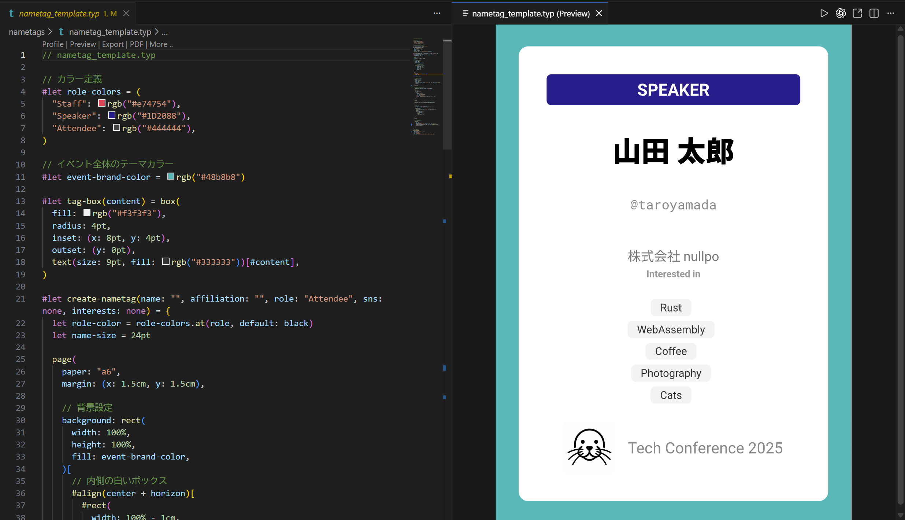
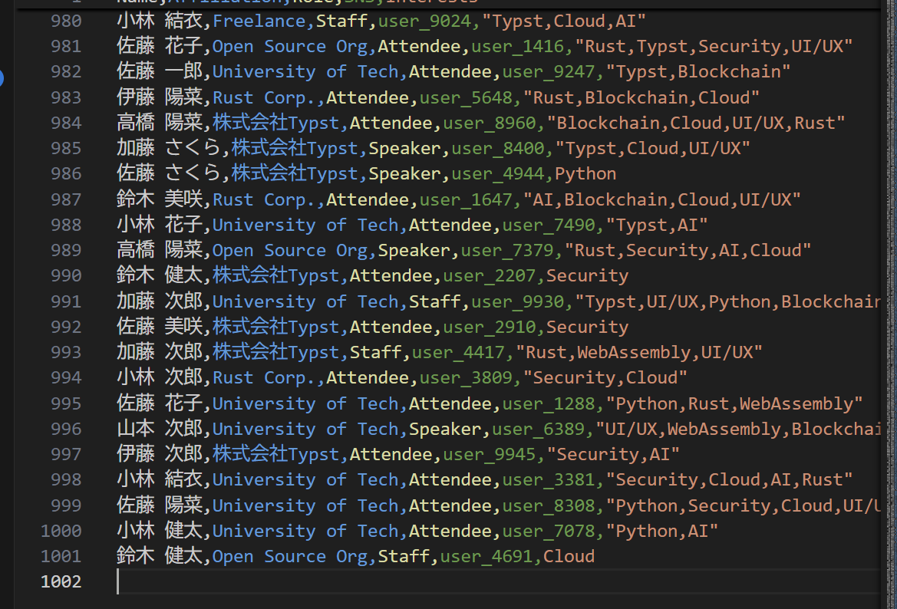
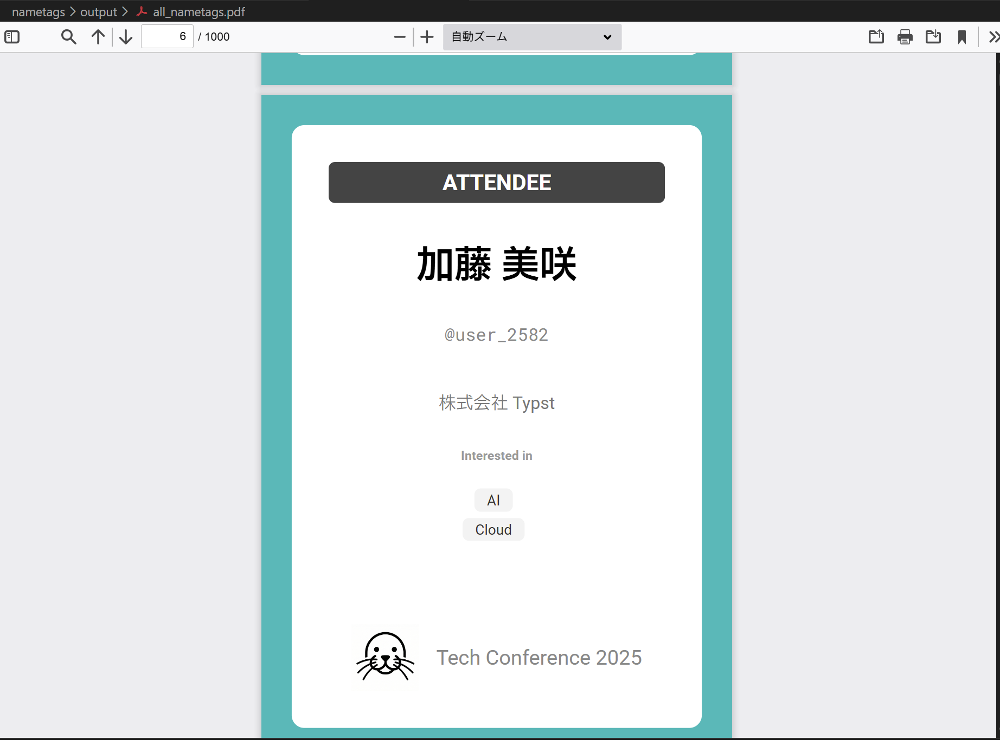

# Typstで紙の名札(PDF)を量産する

## はじめに

この記事ではTypstを用いて、あらかじめ参加者の名前や所属、役割等がわかっている前提で、イベント用の名札をPDF形式で大量に作成する方法について説明します。Typst自体の解説については割愛しますので、既存の日本語記事や[公式ドキュメント](https://typst.app/docs/)、[非公式日本語版ドキュメント](https://typst-jp.github.io/docs/)等を参照してください。

使用する手法としては、Typstが公式にサポートしている[外部データの読み込み](https://typst.app/docs/reference/data-loading/)機能等を利用して、**CSV**ファイルから参加者情報を読み込む、というのがメインになります。今回はCSVファイルを扱いますが、前述のデータ読み込み機能は**YAML**や**JSON**、**XML**などもサポートしているため、必要があればそれらのファイルを利用しても問題ないと思います。

今回想定している「名札」というのは、勉強会やカンファレンス、LT会などで使用される、縦型のA6サイズ(105mm x 148mm)の紙の名札を指します。ただ、この用紙サイズに関しても自由に変更していただいて問題なさそうです(名刺サイズであったり)。Typstの機能を使えばいろいろと凝ったものは作れそうですが、ここでは簡単のために以下のような要素を含んだ名札を作成します。


- 参加者の氏名（フルネーム）
- 所属・会社名・組織名
  - 氏名の下に中くらいの文字サイズで表示する
- 役割・カテゴリ
  - `Attendee` / `Speaker` / `Staff` など
  - 色付きのラベル等で区別できるようにする
- イベント名・ロゴ
  - 下部に小さめに配置する

作り方としては、以下の2パターンを紹介します。
- パターンA: **1つのPDFファイル**に全員分の名札をまとめて出力する
- パターンB: 参加者ごとに**PDFファイルを分割**して出力する

おそらく主に使われるのはパターンAだと思いますが、ファイルごとに管理したい場合もあるかもしれません。ただし、後述しますがパターンBではTypstの標準機能ではなくPythonなどでCSVファイルを読み込み、データを流し込む必要があるので少し手間がかかります。

## 環境

今回この記事を書くにあたって利用した環境を示しておきます。正直これ以外の環境でも問題なく動作すると思います。

- OS: Windows 11
- Typst: 0.14.0

## ディレクトリ構成

今回の記事では最終的に以下のようなディレクトリ/ファイル構成にすることを想定しています。

```text
nametags
├── nametag_template.typ    # 共通テンプレート（パターンA・B共通）
├── all_nametags.typ        # パターンA用Typstファイル
├── single_nametag.typ      # パターンB用Typstファイル
├── participants.csv      # 参加者情報（パターンA・B共通）
├── generate_nametags.py    # パターンB用Pythonスクリプト
├── assets                # 画像等のアセット
│   └── logo.png          # イベントロゴ画像
└── output                # 出力先
    ├── all_nametags.pdf    # パターンAの出力先
    └── single_nametags     # パターンBの出力先
```

各ディレクトリ/ファイルの役割は以下の通りです。

- nametag_template.typ
名札1枚分（A6縦）のレイアウトとロジックを定義するTypstファイルです。氏名・所属・役割ラベル・イベント名・ロゴの配置やスタイルをまとめておき、パターンA/Bのどちらからも共通で読み込みます。

- all_nametags.typ
participants.csvから全参加者分のデータをcsv()で読み込み、1人につき1ページの名札を生成して、複数ページからなる1つのPDF(output/all_nametags.pdf)を出力するエントリポイントです（パターンA）。

- single_nametag.typ
1人分の参加者情報だけを入力として受け取り、その人の名札1枚だけをPDFとして出力するエントリポイントです（パターンB）。Typstのsys.inputs機能などを使ってCLIから値を受け取り、その値をnametag_template.typ内のレイアウト関数に渡します。

- participants.csv
参加者一覧を保持するCSVファイルです。

- generate_nametags.py
パターンB用のPythonスクリプトです。participants.csvを読み込み、各行の参加者情報をsingle_nametag.typに渡してTypstを実行し、output/single_nametags/配下に参加者ごとのPDFファイルを生成します。

- assets/logo.png
名札に表示するイベントロゴ画像です。nametag_template.typからimage("assets/logo.png",...)のように読み込みます。

- output/
生成されたPDFファイルの出力先ディレクトリです。パターンAの出力であるall_nametags.pdfと、パターンBで生成するsingle_nametags/配下のPDFをまとめます。

## 共通テンプレートの作成
まずは名札1枚分のレイアウトとロジックを定義する共通テンプレート`nametag_template.typ`を作成します。

コードの記述にはVSCodeを、プレビューにはVSCodeの拡張機能として提供されている[Tinymist](https://github.com/Myriad-Dreamin/tinymist)を利用しています。
まず`nametag_template.typ`の全文を以下に示します。

```typ
// nametag_template.typ

// カラー定義
#let role-colors = (
  "Staff": rgb("#e74754"),
  "Speaker": rgb("#1D2088"),
  "Attendee": rgb("#444444"),
)

// イベント全体のテーマカラー
#let event-brand-color = rgb("#48b8b8")

#let tag-box(content) = box(
  fill: rgb("#f3f3f3"),
  radius: 4pt,
  inset: (x: 8pt, y: 4pt),
  outset: (y: 0pt),
  text(size: 9pt, fill: rgb("#333333"))[#content],
)

#let create-nametag(name: "", affiliation: "", role: "Attendee", sns: "", interests: "") = {
  let role-color = role-colors.at(role, default: black)

  page(
    paper: "a6",
    margin: (x: 1.5cm, y: 1.5cm),

    // 背景設定
    background: rect(
      width: 100%,
      height: 100%,
      fill: event-brand-color,
    )[
      // 内側の白いボックス
      #align(center + horizon)[
        #rect(
          width: 100% - 1cm,
          height: 100% - 1cm,
          fill: white,
          radius: 8pt,
        )
      ]
    ],
  )[
    #set text(
      font: ("Roboto", "IBM Plex Sans JP"),
      lang: "ja",
    )
    #set align(center)

    // 役割(スタッフ等)
    #block(
      fill: role-color,
      inset: (y: 8pt),
      width: 100%,
      radius: 4pt,
      [#text(fill: white, weight: "bold", size: 14pt, spacing: 2pt)[#upper(role)]],
    )

    #v(1.5em)

    // 氏名とSNSのハンドルネーム
    #block([
      #text(size: 24pt, weight: "black")[#name]

      #v(0.3em)

      #if sns != "" {
        text(
          size: 11pt,
          weight: "regular",
          fill: gray.darken(20%),
          font: "Roboto Mono",
        )[
          #if sns.starts-with("@") { sns } else { "@" + sns }
        ]
      }
    ])

    #v(2em)

    // 所属
    #text(size: 11pt, fill: gray.darken(30%))[#affiliation]

    #v(1fr)

    // 興味タグ
    #if interests != "" {
      let tags = interests.split(",").map(s => s.trim())

      align(center)[
        #text(size: 8pt, weight: "bold", fill: gray.darken(10%))[Interested in]
        #v(5pt)
        #block(width: 100%)[
          #for tag in tags {
            tag-box(tag)
            h(4pt)
            v(4pt, weak: true)
          }
        ]
      ]
    }

    #v(2fr)

    // ロゴとイベント名
    #align(bottom)[
      #stack(
        dir: ltr,
        spacing: 1em,
        image("assets/logo.png", height: 1.5cm, fit: "contain"),
        align(horizon)[#text(size: 13pt, fill: gray.darken(20%))[Tech Conference 2025]],
      )
    ]
  ]
}

```

レイアウトに関しては今回の記事の趣旨とは少し外れるためあまり深堀はしませんが、このような見た目になっています。



以下に軽く各コードの解説を示します。

```typ
// カラー定義
#let role-colors = (
  "Staff": rgb("#e74754"),
  "Speaker": rgb("#1D2088"),
  "Attendee": rgb("#444444"),
)

// イベント全体のテーマカラー
#let event-brand-color = rgb("#48b8b8")
```
ここでは役割ラベルおよびイベントのテーマカラーを定義しています。役割ラベルは、イベントにおける参加者の役割(スタッフ、スピーカー、一般参加者など)ごとに異なる色を割り当てるために使用します。必要であれば、例えばスポンサーを表す色を追加することも簡単にできます。

イベント全体のテーマカラーは名札の外枠に利用されています。必須ではありませんが、何となく見た目がさびしかったので追加しました。

```typ
#let tag-box(content) = box(
  fill: rgb("#f3f3f3"),
  radius: 4pt,
  inset: (x: 8pt, y: 4pt),
  outset: (y: 0pt),
  text(size: 9pt, fill: rgb("#333333"))[#content],
)

```
ここでは興味タグを表示するための小さなボックスを定義しています。レイアウトの定義のみを行っており、実際に興味タグを表示するのは後述の`create-nametag`関数内です。

```typ
#let create-nametag(name: "", affiliation: "", role: "Attendee", sns: "", interests: "") = {
  ...
}
```
ここが名札1枚分のレイアウトとロジックを定義する関数です。引数として参加者の氏名(name)、所属(affiliation)、役割(role)、SNSハンドルネーム(sns)、興味タグ(interests)を受け取ります。`role`引数は省略された場合に`Attendee`が設定されるようになっています。


```typ
let role-color = role-colors.at(role, default: black)
```
ここでは引数で受け取った`role`に基づいて、対応する色を`role-color`変数に設定しています。もし`role`が`role-colors`に存在しない場合はデフォルトで黒色が設定されます。
`rorle-colors`は辞書型で定義されているため、`at`メソッドを使ってキーに対応する値を取得しています。詳しくはTypstにおける[辞書型のドキュメント](https://typst.app/docs/reference/foundations/dictionary/)を参照してください。


```typ
// 背景設定
    background: rect(
      width: 100%,
      height: 100%,
      fill: event-brand-color,
    )[
      // 内側の白いボックス ...
    ],
```
ここでは名札の背景を設定しています。外側の背景はイベントのテーマカラーで塗りつぶし、その内側に白いボックスを配置しています。

```typ
    // 役割(スタッフ等)
    #block(
      fill: role-color,
      inset: (y: 8pt),
      width: 100%,
      radius: 4pt,
      [#text(fill: white, weight: "bold", size: 14pt, spacing: 2pt)[#upper(role)]],
    )
```

ここでは名札の上部に役割ラベルを表示しています。背景色には先ほど取得した`role-color`を使用し、テキストには引数で受け取った`role`を`#upper`で大文字に変換して表示しています。

```typ
    // 氏名とSNSのハンドルネーム
    #block([
      #text(size: 24pt, weight: "black")[#name]

      #v(0.3em)

      #if sns != "" {
        text(
          size: 11pt,
          weight: "regular",
          fill: gray.darken(20%),
          font: "Roboto Mono",
        )[
          #if sns.starts-with("@") { sns } else { "@" + sns }
        ]
      }
    ])
```
ここでは氏名とSNSハンドルネームを表示しています。氏名は大きめのフォントサイズで太字にし、SNSハンドルネームは小さめのフォントサイズでグレーにしています。SNSハンドルネームが空文字列の場合は表示しないようにしています。また、SNSハンドルネームが`@`で始まっていない場合は、自動的に`@`を付与しています。

```typ
    // 興味タグ
    #if interests != "" {
      let tags = interests.split(",").map(s => s.trim())

      align(center)[
        #text(size: 8pt, weight: "bold", fill: gray.darken(10%))[Interested in]
        #v(5pt)
        #block(width: 100%)[
          #for tag in tags {
            tag-box(tag)
            h(4pt)
            v(4pt, weak: true)
          }
        ]
      ]
    }
```
ここでは興味タグを表示しています。引数で受け取った`interests`をカンマ区切りで分割し、各タグをトリムしてリストに変換しています。その後、各タグを先ほど定義した`tag-box`関数を使って表示しています。`interests`が空文字列の場合は興味タグのセクション自体を表示しないようにしています。もしかすると単に縦に積むのではなく、ある程度横に並べた後一定の長さに達したら改行...というようにしたほうが良いような気もしますが、今回はシンプルに縦に積む形にしています(Typstのスクリプティング機能は強力なので頑張ればできると思います)。

```typ
    // ロゴとイベント名
    #align(bottom)[
      #stack(
        dir: ltr,
        spacing: 1em,
        image("assets/logo.png", height: 1.5cm, fit: "contain"),
        align(horizon)[#text(size: 13pt, fill: gray.darken(20%))[Tech Conference 2025]],
      )
    ]
```
ここでは名札の下部にイベントロゴとイベント名を表示しています。ロゴ画像は`assets/logo.png`から読み込み、高さを1.5cmに設定しています。イベント名は適当なフォントサイズでグレーにしています。イベント名やロゴ画像のパスは必要に応じて変更してください。

以上で共通テンプレート`nametag_template.typ`の解説は終了です。ここからは、現時点で仮の文字列を挿入している部分に、実際の参加者データを流し込む方法について説明します。

## CSVファイルの用意
次に参加者情報を保持するCSVファイルである`participants.csv`を用意します。実用性を確認しておきたいため、今回は参加者1000人分のダミーデータを以下のPythonスクリプトで生成しました。

```python
import csv
import random

# 設定
OUTPUT_FILE = "participants.csv"
COUNT = 1000

# ダミーデータの素材
LAST_NAMES = ["佐藤", "鈴木", "高橋", "田中", "伊藤", "渡辺", "山本", "中村", "小林", "加藤"]
FIRST_NAMES = ["太郎", "花子", "一郎", "次郎", "さくら", "健太", "結衣", "陽菜", "大輔", "美咲"]
AFFILIATIONS = ["株式会社Typst", "Rust Corp.", "Design Inc.", "Freelance", "University of Tech", "Open Source Org"]
ROLES = ["Attendee", "Attendee", "Attendee", "Speaker", "Staff"] # Attendeeの比率を高めに
INTERESTS_LIST = ["Rust", "Typst", "Python", "WebAssembly", "UI/UX", "Cloud", "Security", "AI", "Blockchain"]

def generate_random_person():
    name = f"{random.choice(LAST_NAMES)} {random.choice(FIRST_NAMES)}"
    affiliation = random.choice(AFFILIATIONS)
    role = random.choice(ROLES)
    sns = f"user_{random.randint(1000, 9999)}"
    
    # 興味タグをランダムに1~4個選ぶ
    interests_count = random.randint(1, 4)
    interests = ",".join(random.sample(INTERESTS_LIST, interests_count))
    
    return {
        "Name": name,
        "Affiliation": affiliation,
        "Role": role,
        "SNS": sns,
        "Interests": interests
    }

def main():
    print(f"Generating {COUNT} dummy records...")
    
    with open(OUTPUT_FILE, 'w', encoding='utf-8', newline='') as f:
        writer = csv.DictWriter(f, fieldnames=["Name", "Affiliation", "Role", "SNS", "Interests"])
        writer.writeheader()
        
        for _ in range(COUNT):
            writer.writerow(generate_random_person())
            
    print(f"Done! Saved to {OUTPUT_FILE}")

if __name__ == "__main__":
    main()
```

これによって、以下の画像のようなCSVファイルが生成されます。1行目はヘッダー行で、2行目以降に各参加者の情報が格納されています。



これを用いて1000人分の名札を生成してみます。

## パターンA: 1つのPDFファイルに全員分の名札をまとめて出力する
まずはパターンAとして、1つのPDFファイルに全員分の名札をまとめて出力する方法について説明します。この場合、Typstの標準機能のみで完結します。
先ほど作成した共通テンプレート`nametag_template.typ`を読み込み、CSVファイルから参加者情報を取得して、1人分ずつ名札を生成するTypstファイル`all_nametags.typ`を作成します。以下にその全文を示します。

```typ
// all_nametags.typ

// テンプレートの読み込み
#import "nametag_template.typ": create-nametag

// CSVファイルのパス
#let csv-path = "participants.csv"

// CSVの読み込み
#let csv-data = csv(csv-path)

// ヘッダーを削除しデータ部分だけ抽出
#let participants = csv-data.slice(1)


// ループ処理で全員分のページを出力
#for row in participants {
  // CSVのカラム順序: Name, Affiliation, Role, SNS, Interests
  let name = row.at(0, default: "")
  let affiliation = row.at(1, default: "")
  let role = row.at(2, default: "Attendee")
  let sns = row.at(3, default: "")
  let interests = row.at(4, default: "")

  // テンプレート関数を呼び出し
  create-nametag(
    name: name,
    affiliation: affiliation,
    role: role,
    sns: sns,
    interests: interests
  )

}
```

```typ
// テンプレートの読み込み
#import "nametag_template.typ": create-nametag

// CSVファイルのパス
#let csv-path = "participants.csv"

// CSVの読み込み
#let csv-data = csv(csv-path)

// ヘッダーを削除しデータ部分だけ抽出
#let participants = csv-data.slice(1)
```
ここでは先ほど作成した共通テンプレート`nametag_template.typ`から`create-nametag`関数をインポートしています。
また、`csv()`関数を使って`participants.csv`ファイルを読み込み、1行目のヘッダー行を削除してデータ部分だけを`participants`変数に格納しています。
csv()関数の詳細については[公式ドキュメント](https://typst.app/docs/reference/data-loading/csv/)を参照してください。

```typ
// ループ処理で全員分のページを出力
#for row in participants {
  // CSVのカラム順序: Name, Affiliation, Role, SNS, Interests
  let name = row.at(0, default: "")
  let affiliation = row.at(1, default: "")
  let role = row.at(2, default: "Attendee")
  let sns = row.at(3, default: "")
  let interests = row.at(4, default: "")

  // テンプレート関数を呼び出し
  create-nametag(
    name: name,
    affiliation: affiliation,
    role: role,
    sns: sns,
    interests: interests
  )

}
```
その後、`#for`ループを使って各参加者のデータ行を反復処理しています。各行から氏名、所属、役割、SNSハンドルネーム、興味タグを抽出し、先ほどインポートした`create-nametag`関数に引数として渡しています。これにより、各参加者ごとに1ページ分の名札が生成されます。それでは`output`ディレクトリを作成し、コンパイルしてみましょう。

```
typst compile all_nametags.typ output/all_nametags.pdf
```

これで`output/all_nametags.pdf`に全員分の名札がまとめて出力されます。PDFビューアで開いて確認してみましょう。



ちゃんと1000人分の名札が生成されていることが確認できました。

ところで、コンパイル時間はどの程度だったのでしょうか？私の環境ではとても高速で、数秒以内に完了したように思えましたが、念のため正確な時間を計測してみました。`output`ディレクトリの中身を一度削除したのち、WindowsのPowerShellで以下のコマンドを実行しています。

```powershell
Measure-Command { typst compile all_nametags.typ output/all_nametags.pdf }
```

すると、以下のような結果が得られました。

```plaintext
Days              : 0
Hours             : 0
Minutes           : 0
Seconds           : 0
Milliseconds      : 755
Ticks             : 7558770
TotalDays         : 8.74857638888889E-06
TotalHours        : 0.000209965833333333
TotalMinutes      : 0.01259795
TotalSeconds      : 0.755877
TotalMilliseconds : 755.877
```

すなわち、1000人分の名札を生成するのに約756ミリ秒(0.756秒)しかかかっていません。これならば、参加者数が数千人程度であっても十分に実用的に利用できそうです。

## パターンB: 参加者ごとにPDFファイルを分割して出力する
次にパターンBとして、参加者ごとにPDFファイルを分割して出力する方法について説明します。この場合、Typstの標準機能だけでは完結しないため、Pythonスクリプトを用いてCSVファイルを読み込み、各参加者ごとにTypstを実行してPDFファイルを生成します。まずは参加者1人分の名札を生成するTypstファイル`single_nametag.typ`を作成します。こちらは全員分のものを1つのファイルとして作成するものに比べれば非常にシンプルです。

```typ
// single_nametag.typ
#import "nametag_template.typ": create-nametag

// コマンドライン引数(--input)から値を辞書として取得
#let inputs = sys.inputs

// 受け取ったデータを使って名札を生成
#create-nametag(
  name: inputs.at("name", default: ""),
  affiliation: inputs.at("affiliation", default: ""),
  role: inputs.at("role", default: "Attendee"),
  sns: inputs.at("sns", default: ""),
  interests: inputs.at("interests", default: ""),
)
```

特筆すべき点としては、`sys.inputs`を使ってコマンドライン引数から値を辞書として受け取っている点です。これにより、Pythonスクリプトから各参加者の情報を引数として渡すことができます。

それでは、Pythonスクリプト`generate_nametags.py`を作成します。このスクリプトは`participants.csv`を読み込み、各参加者ごとに`single_nametag.typ`を実行してPDFファイルを生成します。以下にその全文を示します。

